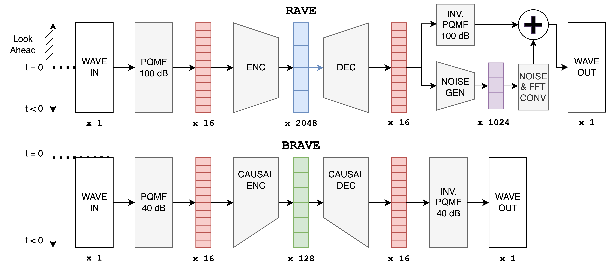

# BRAVE_release

<h1 align="center">Designing Neural Synthesizers for Low Latency Interaction</h1>
<div align="center">
<h3>
    <a href="http://insert_link_here" target="_blank">paper</a> - <a href="https://fcaspe.github.io/brave" target="_blank">website</a>
</h3>

</div>

<center>

</center>

This repo contains the official Pytorch implementaiton of **BRAVE** a low-latency real-time audio variational encoder for instrumental performance. It also implements all of the other models tested on the paper.

## Install

We use the **acids-rave** package for preprocessing the data and training the models.

```bash
pip install acids-rave==2.3 h5py
conda install ffmpeg
# [TODO] git clone the repo chdir
```
## Preparing Dataset

We use the same `rave preprocess` tool as RAVE for dataset preparation. RAVE datasets will work with this repo's models. [Check RAVE's repo for more info on dataset preparation](https://github.com/acids-ircam/RAVE).

```bash
rave preprocess --input_path /audio/folder --output_path /dataset/path --channels X
```

## Training

We use the same `rave train` CLI for training. Make sure to specify with `--config` a path to one of the `.gin` configs provided in this repo. For instance, to train BRAVE:

```bash
rave train --config ./configs/brave.gin --name my_brave_run --db_path path/to/my/dataset
```

## Export to low-latency Demo Plugin

Use the `export_brave_plugin.py` utility to export a trained model for running on the demo plugin.  
**NOTE:** This requires a standard checkpoint (`.ckpt`) created with `rave train`. It does not work with models exported to TorchScript (`.ts`).

```bash
python ./scripts/export_brave_plgin.py --model path/to/model_checkpoint.ckpt --output_path ./exported_model.h5
```
**NOTE:** BRAVE performs best when run at its original sampling rate. For best results, make sure that you run the plugin **at the same sample rate as the data used to train it**.

## Export BRAVE to RAVE's runtime tools (max, livecoding  . . .)

I have no idea of whether they will work . . .